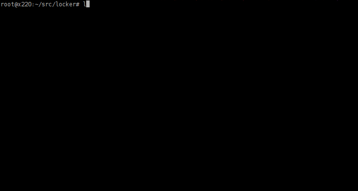

About Locker
===============

Locker is my take on `Docker <http://www.docker.com>`_  + `fig <http://fig.sh>`_
applied for `Linux containers (LXC) <https://linuxcontainers.org/>`_. Locker
wraps the lxc utilities like fig does for Docker.

Locker is not yet a production ready solution but a prototype implementation.
Its feature set is mainly focused on my personal application domain. Most
notably, I required a solution to set up groups of Ubuntu containers with
bind-mounted folders to store critical data and to make services from the
containers available to the outside world by port forwarding. I needed a
complete base installations in the containers to support security auto-updates,
cron jobs, ssh access, etc. which ruled out pure application containers. Locker
is a simple Python application that simplifies these tasks.

Please consider that Linux containers do not ship with an installed application
like Docker containers. Linux containers are usually created based on template
files, i.e., you get a base installation of your user space of choice. You
either must write your own enhanced LXC template, install your application
manually, or deploy your application by using a configuration management system
like `puppet <http://puppetlabs.com/puppet/what-is-puppet>`_,
`chef <https://www.chef.io/chef/>`_, ...

Features
--------

Locker currently supports the following features:

- Define groups of containers in a YAML file similar to fig's syntax
- Create, start, stop, and remove groups or selections of containers defined in
  the particular project
- Show the status of containers in your project
- Create containers as clones or based on LXC templates
- Create an ``fstab`` file to enable bind mounted directories from the host into the
  container(-s)
- Optionally, bind-mounted folders may be moved from the container to the host
  after container creation, so that you do not mount empty folders within your
  container (needs more testing)
- Add or remove port forwarding netfilter rules
- Multi-colored output (can be optionally disabled)
- (Simple) Linking of containers by adding their hostnames to ``/etc/hosts``
- Set cgroup configuration (experimental feature)

Challenges implementing Locker
------------------------------

Some convenience features are missing in the lxc user utilities. Hence Locker
must implement features where `fig <http://fig.sh>`_ can simply rely on
`Docker <http://www.docker.com>`_.

- lxc does not support port forwarding, resp. does not provide an easy way to
  add/remove netfilter rules. Of course, you can always use iptables directly
  but that is not really convenient for everybody.
- lxc containers can communicate with each other in the default configuration as
  they are behind the same bridge device. Yet the hostnames/full qualified
  domain names are not known, i.e., there is no "linking" support.
- In general, the lxc container and network configuration requires manual
  work/modifications, e.g., when containers shall get static IP addresses.
- For some users it may be undesirable that containers are actually NAT-ted
  behind the default bridge device and that they can communicate with each other
  at all. This can be changed but, again, there is no convenient frontend or
  command line tool.

Note: Please correct me if I am wrong or if there is some solution available!
This would really help me. Thanks!

Usage
===============

Under construction...

Installation
------------

.. code:: bash

   $ ./setup.py install

Defining a Project
------------------

An example project definition in YAML:

.. code:: yaml

    db:
        template:
            name: "ubuntu"
            release: "precise"
        ports:
        - "8000:8000"
        - "8000:8000/udp"
        - "8001:8001/tcp"
        volumes:
        - "/opt/data/db/var_log:/var/log"
        - "/opt/data/db/etc:/etc"
        fqdn: 'db.example.net'
    web:
        clone: "ubuntu"
        ports:
        - "192.168.2.123:8002:8002"
        - "192.168.2.123:8003:8003/tcp"
        - "192.168.2.123:8003:8003/udp"
        volumes:
        - "/opt/data/$name/var_log:/var/log"
        links:
        - "db:database"
    foo:
        template:
            name: "ubuntu"
            release: "precise"
        links:
        - "db"
        cgroup:
        - "memory.limit_in_bytes=200000000"
        - "cpuset.cpus=0,1"
        - "cpu.shares=512"

Volumes define bind-mounts of directories on the host system into the container.
You can use some simple placeholders like ``$name`` or ``$project`` in your volume
definitions.

Different formats of port forwarding rules (``ports``) are supported. If the
protocol is not specified, the default, i.e. ``tcp``, will be used to configure
netfilter rules. The ``fqdn`` attribute enables to set the container's hostname
and full qualified domain name (``fqdn``). This is realized by a lxc hook script
that is run after the mounting has been done. Several applications rely on the
``fqdn``, e.g., the puppet agent of the puppet configuration system generates
and selects TLS/SSL certificates based on the fqdn.

``links`` entries will add the specified, i.e., linked container's hostname,
optional alias, and optional fqdn to the linking container's ``/etc/hosts`` file.

You can apply ``cgroup`` settings by providing a list of strings where each
string is of the format ``key=value``. Be careful with this feature.

Managing the Lifecycle
----------------------

Creating, starting, stopping, removing containers and netfilter modifications
(some output omitted):

.. code::

    $ locker create
    [...]
    $ locker start locker_web locker_db
    2014-12-07 12:56:23,596, INFO, Starting container locker_db
    2014-12-07 12:56:24,758, INFO, Starting container locker_web
    $ locker stop locker_web
    2014-12-07 12:57:14,198, INFO, Stopping container locker_web
    $ locker rm locker_web
    Delete locker_web? [y/N]: y
    2014-12-07 12:57:32,940, WARNING, Container locker_web is already stopped
    $ locker ports
    2014-12-07 13:47:56,917, INFO, Adding port forwarding rules for locker_db
    2014-12-07 13:47:56,944, INFO, No port forwarding rules for locker_foo
    2014-12-07 13:47:56,947, INFO, locker_web is not running, skipping adding ports rules
    $ locker rmports
    2014-12-07 13:48:51,413, INFO, Removing netfilter rules
    2014-12-07 13:48:51,416, WARNING, Container locker_db is still running, services will not be available anymore
    2014-12-07 13:48:51,422, INFO, Removing DNAT udp rule of "locker_db"
    2014-12-07 13:48:51,424, INFO, Removing DNAT tcp rule of "locker_db"
    2014-12-07 13:48:51,434, INFO, Removing FORWARD udp rule of "locker_db"
    2014-12-07 13:48:51,435, INFO, Removing FORWARD tcp rule of "locker_db"

Container Status
----------------

Example output:

.. code::

    $ locker status
      Def.   Name         FQDN             State     IPs          Ports                          Links
    --------------------------------------------------------------------------------------------------------
      True   locker_db    db.example.net   RUNNING   10.0.3.118   0.0.0.0:8001->8001/tcp
                                                                  0.0.0.0:8000->8000/udp
                                                                  0.0.0.0:8000->8000/tcp
      True   locker_foo                    RUNNING   10.0.3.94                                   locker_db
      True   locker_web                    RUNNING   10.0.3.21    192.168.2.123:8003->8003/udp   locker_db
                                                                  192.168.2.123:8003->8003/tcp
                                                                  192.168.2.123:8002->8002/tcp

Help
----

locker's help output:

.. code::

    usage: locker [-h] [--verbose [VERBOSE]] [--version [VERSION]]
                [--delete-dont-ask [DELETE_DONT_ASK]]
                [--dont-copy-on-create [DONT_COPY_ON_CREATE]] [--file FILE]
                [--project PROJECT] [--restart [RESTART]]
                [--no-ports [NO_PORTS]] [--no-links [NO_LINKS]]
                [--no-color [NO_COLOR]] [--extended [EXTENDED]]
                [{start,stop,reboot,rm,create,status,ports,rmports,links,rmlinks,cgroup}]
                [containers [containers ...]]

    Manage LXC containers.

    positional arguments:
    {start,stop,reboot,rm,create,status,ports,rmports,links,rmlinks}
                            Commmand to run
    containers            Space separated list of containers (default: all
                            containers)

    optional arguments:
    -h, --help            show this help message and exit
    --verbose [VERBOSE], -v [VERBOSE]
                            Show more output
    --version [VERSION]   Print version and exit
    --delete-dont-ask [DELETE_DONT_ASK], -x [DELETE_DONT_ASK]
                            Don't ask for confirmation when deleting
    --dont-copy-on-create [DONT_COPY_ON_CREATE], -d [DONT_COPY_ON_CREATE]
                            Don't copy directories/files defined as bind mounts to
                            host after container creation (default: copy
                            directories/files)
    --file FILE, -f FILE  Specify an alternate locker file (default: locker.yml)
    --project PROJECT, -p PROJECT
                            Specify an alternate project name (default: directory
                            name)
    --restart [RESTART], -r [RESTART]
                            Restart already running containers when using "start"
                            command
    --no-ports [NO_PORTS], -n [NO_PORTS]
                            Do not add/remove netfilter rules (used with command
                            start/stop)
    --no-links [NO_LINKS], -m [NO_LINKS]
                            Do not add/remove links (used with command start/stop)
    --no-color [NO_COLOR], -o [NO_COLOR]
                            Do not use colored output
    --extended [EXTENDED], -e [EXTENDED]
                            Show extended status report

About the commands:

:create:
    Create new containers based on templates or as clones. The container's
    "template" subtree in the YAML configuration is provided as the template's
    arguments.
:start:
    Start the container and run the ports command, i.e., add netfilter rules on.
:stop:
    Stop the container and run the rmports command, i.e., remove netfilter rules.
:reboot:
    As the name implies: stop the container (if running) and start it afterwards.
:ports:
    Add port, i.e., netfilter rules. Automatically done when using start
    command.
:rmport:
    Remove port i.e., netfilter rules. Automatically done when using stop
    command.
:status:
    Show container status. An extended status report is available when the
    particular parameter is used.
:links:
    Add/updates links in container. Automatically done when using start command.
    Subsequent calls will update the links and remove stale entries of
    not properly stopped/crashed containers.
:rmlinks:
    Removes all links from the container.
:cgroup:
    (Re-)Apply cgroup settings. Automatically done when starting containers.

Limitations & Issues
====================

- Must be run as root. Unprivileged containers are not yet supported.
- Does not catch malformed YAML files
- Only directories are supported as bind mounts (``volumes``)
- Documentation and examples should be further extended.
- When changing memory or CPU limits via the cgroup settings, these changes are
  not "seen" by most user space tools. For more information have a look at the
  `blog post <http://fabiokung.com/2014/03/13/memory-inside-linux-containers/>`_
  of Fabio Kung.

Requirements
============

- Python3 and the following modules:

  - lxc (official lxc bindings from the linux containers project)
  - see list of requirements in setup.py

- Linux containers userspace tools and libraries

To-Dos / Feature Wish List
==========================

- Resolve everything on the limitations & issues list :-)
- Networking related:

  - Support IPv6 addresses and netfilter rules
  - Add and use custom bridge device (e.g. locker0)

    - Prevent communication between containers in the default configuration
    - Add netfilter rules for inter-container commmunication when "links" are
      defined

  - Link backwards, i.e., add name + fqdn of the linking container to target
    container. This may be beneficial, e.g., when database logs shall contain
    the hostname

- Configuration related:

  - Support different container paths
  - Support setting parameters in the container's config
    (e.g. ``/var/lib/lxc/container/config``) via the YAML configuration.
  - Setting environment variables in linked containers?! Not required in my use
    cases. Name resolution is more important as the initial configuration of
    applications is realized by a configuration management system.
  - ``lxc-create`` may use the ``download`` template to download images from the
    `offical LXC website <http://images.linuxcontainers.org/images/>`_. Maybe
    this can be used via the Python binding?!? For sure the YAML configuration
    needs to be extended to support this feature.

- Source code related:

  - Write real unit tests without side-effects (see next section for further
    information)

- Miscellaneous:

  - Evaluate the order in which to create new cloned containers to handle
    dependency problems (containers are currently created in alphabetical order)
  - Add Debian package meta-data
  - Export and import of containers, optionally including the bind-mounted data
  - Support execution of commands inside the container after creation, e.g., to
    install and run the `puppet <http://puppetlabs.com/puppet/what-is-puppet>`_
    agent

Test Cases
==========

.. warning:: These are not unit tests that can be run without any side effects.
             In fact, the test cases are more akin to integration tests. Each
             test case actually creates, starts, stops, etc. containers on the
             test system. As these "external resources" are used, you will
             change the state of your system.
             Currently I refrain from writing better test cases with mocked
             classes/methods that do not change the running system. As far as I
             know there is no easy way to replace ``lxc.Container`` with a mock
             where all derived classes (e.g. ``locker.Container``) also will use
             the mocked base class.

Test cases can be run easily with ``nosetest`` including a coverage analysis,
example:

.. code::

    nosetests3 --with-coverage --cover-package=locker --cover-html --cover-erase

Many test cases rely on the example YAML project configuration that is available
as ``docs/locker.yml``.

Words of Warning
================

.. warning::
    - Use at your own risk
    - May destroy your data
    - Many errors and misconfigurations are not caught yet and may result in
      undefined states
    - The feature to set cgroup configuration via the YAML file has high
      potential to shoot yourself in the foot
    - Test in an expendable virtual machine first!
    - Compatibility may be broken in future versions

License
============

Published under the GPLv3 or later
